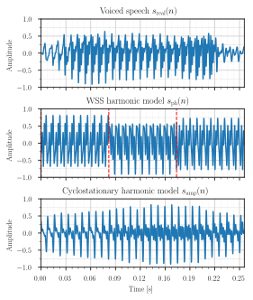

# Harmonics to the rescue: why voiced speech is not a WSS process
## Introduction
This code accompanies the paper *"Harmonics to the rescue: why voiced speech is not a WSS process"*.
The paper was accepted for the 18th International Workshop on Acoustic Signal Enhancement (**IWAENC 2024**). 
The code is written in Python. 

<p align="center">
  
</p>

## Installation
To install the required libraries, run
```
pip install -r requirements.txt
```

## Usage
To run the experiments, run
```
python main.py
```

The figures are generated with
```
python zz_plot_real_synthetic_vowel.py
```
